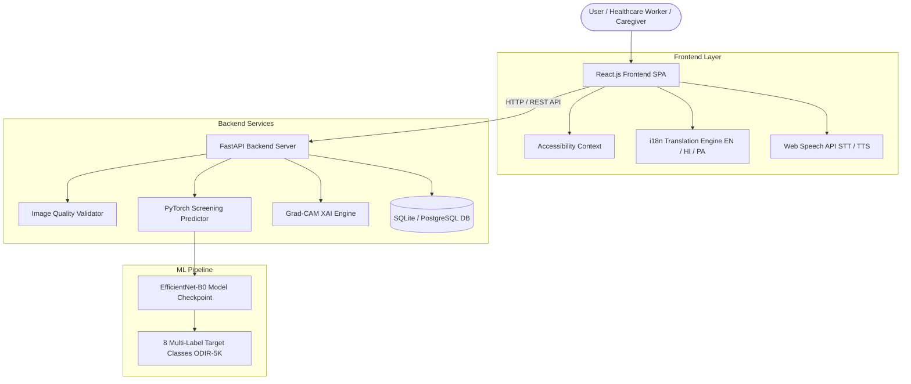

# CareLens AI - System Architecture Document

## Overview

**CareLens AI** is an AI-assisted early eye-health screening platform designed to make preliminary retinal-image screening accessible, explainable, and patient-understandable while strictly adhering to medical safety positioning.

Tagline: *"Detect Earlier. Understand Better. Act Sooner."*

---

## Architectural Principles

1. **Medical Decision-Support Positioning**: The system strictly functions as a decision support and preliminary screening tool. It **never** claims clinical diagnosis, replaces doctors, or prescribes treatment.
2. **Accessibility-First Design**: Accessibility is a core product feature. Voice interaction, Text-to-Speech (TTS), Speech-to-Text (STT), High Contrast Mode, Font Scaling, Keyboard Navigation, and Multilingual support (EN, HI, PA) are native to the core interface.
3. **Defensible ML Pipeline**: Built using transfer learning (`EfficientNet-B0`/`ResNet50`) on the verified **ODIR-5K** benchmark retinal fundus dataset with patient-aware data splitting to eliminate data leakage.
4. **Pre-Screening Quality Gatekeeper**: An automated quality validator screens images for blur, extreme illumination, resolution, and retinal fundus features before passing data to the AI model.
5. **Explainable AI (Grad-CAM)**: Provides spatial heatmap overlay visualizations paired with safe, simple patient-friendly summaries.

---

## High-Level Architecture Diagram

---

## Technology Stack

- **Frontend**: React.js 18, Vite, TailwindCSS, Lucide Icons, Web Speech API.
- **Backend**: Python 3.14, FastAPI, Pydantic v2, SQLAlchemy, Uvicorn.
- **Machine Learning**: PyTorch, Torchvision, OpenCV, NumPy, Scikit-learn, Matplotlib.
- **Database**: SQLite (default local zero-config) / PostgreSQL (production).
- **Deployment**: Docker, Docker Compose, Gunicorn/Uvicorn.
